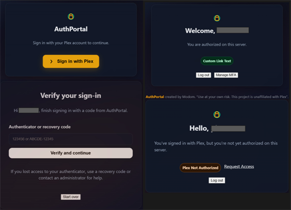
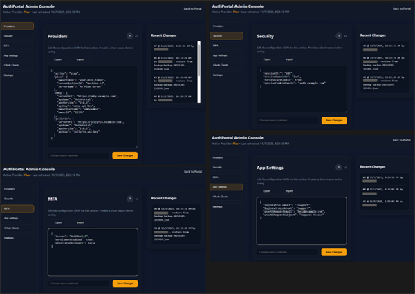
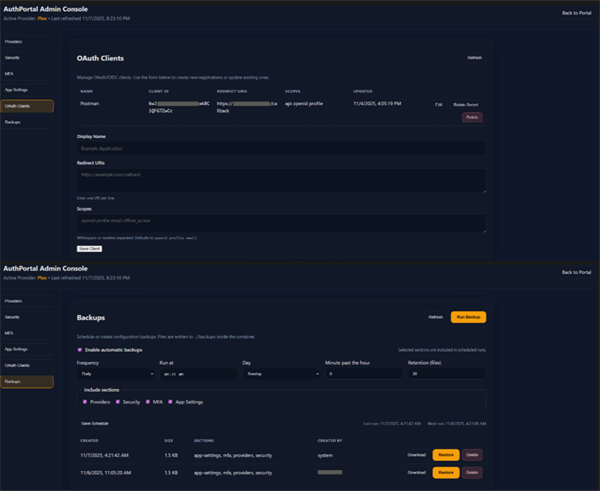

# AuthPortal (v2.0.3)

[](https://hub.docker.com/r/modomofn/auth-portal)
[](https://hub.docker.com/r/modomofn/auth-portal)
[](https://go.dev/)
[](https://github.com/modom-ofn/auth-portal?tab=GPL-3.0-1-ov-file#readme)
[](https://developers.openai.com/codex/windows)

**AuthPortal** is a lightweight, self-hosted authentication gateway built for Plex, Jellyfin, and Emby ecosystems. It provides a unified login experience for media-based communities and home-lab environments—issuing secure, signed sessions for use across your intranet portals and apps.

AuthPortal authenticates users directly against their connected media server accounts, seals the server tokens for reuse, and manages session lifecycle via HTTP-only cookies. Authorized users are directed to their personalized home page, while unrecognized users are served a restricted or “guest” view.

> [!IMPORTANT]
> **Use at your own risk.** This project leans on Vibe Coding practices - AI pair-programming, automated refactors, and rapid iteration. Treat releases as starting points - test, monitor, and adapt to your stack. AuthPortal remains an independent effort with no endorsement from Plex, Emby, or Jellyfin.

> [!NOTE]
> - Docker Hub: https://hub.docker.com/r/modomofn/auth-portal
> - GitHub Repo: https://github.com/modom-ofn/auth-portal

---

## Features

- **Unified login gateway**
  - Supports Plex authentication and Emby/Jellyfin username+password login
  - Responsive modal-style interface for seamless in-browser authentication

- **Secure session management**
  - Signed, HTTP-only JWT cookie for authorized sessions
  - Optional TOTP-based multi-factor authentication (with recovery codes)
  - Per-tenant MFA enforcement toggles

- **Enterprise-ready expansion**
  - Optional LDAP integration for downstream application SSO requirements
  - Extensible provider architecture

- **Lightweight deployment**
  - Single-binary, fully containerized service
  - Simple environment-variable configuration
  - Minimal external dependencies

- **Customizable experience**
  - Two distinct home pages: authorized vs. unauthorized
  - Dark, modern UI with branded login buttons

- **Runtime configuration & admin console**
  - Web-based editing of Providers, Security, and MFA JSON with versioning and history
  - OAuth client management (list/create/update/delete + secret rotation) without leaving the browser
  - Config backup tab with manual exports, scheduled runs (hourly/daily/weekly), retention, and one-click restore/download actions

- **First-party OAuth 2.1 / OIDC**
  - Authorization-code + PKCE, optional `offline_access` refresh rotation, RS256-signed ID tokens
  - Discovery, JWKS, token, and userinfo endpoints ready for downstream apps and identity brokers

### UI Preview

Unified login flow with Plex, Jellyfin, and Emby buttons:
<a href="screenshots/auth-portal-login-flow.png">
  
</a>

MFA enrollment and recovery code management:
<a href="screenshots/auth-portal-mfa-pages.png">
  
</a>

Admin console showing provider, security, and MFA configuration tabs:
<a href="screenshots/auth-portal-admin-pages-1.png">
  
</a>

Admin console showing OAuth clients and backups tab with scheduled runs and retention controls
<a href="screenshots/auth-portal-admin-pages-2.png">
  
</a>

---

## Table of Contents

- [Features](#features)
- [What's New in v2.0.3](#whats-new-in-v203)
- [ldap-sync](#ldap-sync)
- [Quick Start](#quick-start)
- [Configuration](#configuration)
  - [Admin Console & Config Store (new in v2.0.3)](#admin-console--config-store-new-in-v203)
  - [Backups](#backups)
  - [OAuth 2.1 / OIDC Authorization Server (new in v2.0.3)](#oauth-21--oidc-authorization-server-new-in-v203)
  - [Multi-factor authentication](#multi-factor-authentication)
  - [Plex](#plex)
  - [Jellyfin](#jellyfin)
  - [Emby](#emby)
- [Providers (Plex / Jellyfin / Emby)](#providers-plex--jellyfin--emby)
- [Security Notes](#security-notes)
- [Database](#database)
- [Build & Images](#build--images)
- [Logging](#logging)
- [HTTP Routes](#http-routes)
- [Frontend Bits](#frontend-bits)
- [How it works](#how-it-works)
- [Customization](#customization)
- [Security best practices](#security-best-practices)
- [Contributing](#contributing)
- [License](#license)
- [Upgrade Guide (from < v2.0.2)](#upgrade-guide-from--v202)

---

## What's New in v2.0.3

- **Runtime config store + admin console:** JSON-backed providers/security/MFA configuration with optimistic concurrency, history audit, and inline editing from `/admin`. Bootstrap admin accounts via `ADMIN_BOOTSTRAP_USERS`.
- **OAuth 2.1 / OIDC authorization server:** Authorization-code + refresh grants with PKCE, signed ID tokens, consent tracking, and optional `offline_access` refresh rotation. Includes discovery, JWKS, token, and userinfo endpoints.
- **Admin OAuth client management:** List/create/update/delete clients, rotate secrets, and expose new secrets in the UI. All backed by new `/api/admin/oauth/*` routes.

---

## ldap-sync

> [!NOTE]
> - ldap-sync has been moved to its own repository.  
> - You can now find it at: https://github.com/modom-ofn/ldap-sync

---

## Quick Start

1) **.env**

```env
# ---------- Core ----------
POSTGRES_PASSWORD=change-me-long-random
SESSION_SECRET=change-me-32+chars-random
SESSION_COOKIE_DOMAIN=yourdomain.com
APP_BASE_URL=http://localhost:8089

# Trusted proxy CIDR ranges for forwarded headers (comma separated; leave blank to disable)
TRUSTED_PROXY_CIDRS=

# Multi-factor authentication
MFA_ENABLE=1
MFA_ENFORCE=0
MFA_ISSUER=AuthPortal

# Authorized page extra link (optional)
LOGIN_EXTRA_LINK_URL=/some-internal-app
LOGIN_EXTRA_LINK_TEXT=Open Internal App

# Unauthorized page "Request Access" mailto link
UNAUTH_REQUEST_EMAIL=support@example.com
UNAUTH_REQUEST_SUBJECT=AuthPortal Access Request

# Set 'MEDIA_SERVER=' options: plex | emby | jellyfin
MEDIA_SERVER=plex

# Set 'FORCE_SECURE_COOKIE=1' in prod; if behind TLS/NGINX with X-Forwarded-Proto use 1
FORCE_SECURE_COOKIE=0
# Force HSTS headers even if APP_BASE_URL is http (set to 1 when TLS terminates upstream)
FORCE_HSTS=0
# Timezone (IANA name, e.g., America/New_York) used for schedules and timestamps
APP_TIMEZONE=UTC
# Container timezone (usually matches APP_TIMEZONE)
TZ=UTC

# 32-byte base64 key (e.g., openssl rand -base64 32) (Do Not Reuse Example Below)
DATA_KEY=5Z3UMPcF9BBkpB2SkuoXqYfGWKn1eXzpMdR8EyMV8dY=

# Admin bootstrap (comma-separated username:email pairs)
ADMIN_BOOTSTRAP_USERS=admin:admin@example.com

# OAuth2/OIDC signing & issuer (provide one of *_KEY or *_KEY_PATH)
OIDC_SIGNING_KEY_PATH=/run/secrets/oidc_signing_key.pem
OIDC_SIGNING_KEY=
OIDC_ISSUER=https://auth.example.com

# Logging # DEBUG | INFO | WARN | ERROR
LOG_LEVEL=INFO

# ---------- LDAP (only if using `--profile ldap`) ----------
LDAP_ADMIN_PASSWORD=change-me-strong

# ---------- Plex ----------
# Optional but recommended for server-authorization checks
PLEX_OWNER_TOKEN=plxxxxxxxxxxxxxxxxxxxx

# Either set machine id or a server name (machine id wins if both present)
PLEX_SERVER_MACHINE_ID=
PLEX_SERVER_NAME=

# ---------- Emby ----------
EMBY_SERVER_URL=http://localhost:8096
EMBY_APP_NAME=AuthPortal
EMBY_APP_VERSION=2.0.3
# EMBY_API_KEY=
EMBY_OWNER_USERNAME=
EMBY_OWNER_ID=

# -------- Jellyfin ---------
JELLYFIN_SERVER_URL=http://localhost:8096
JELLYFIN_API_KEY=
JELLYFIN_APP_NAME=AuthPortal
JELLYFIN_APP_VERSION=2.0.3
```


2) **docker-compose.yaml**

```yaml
version: "3.9"

services:
  postgres:
    image: postgres:15
    restart: unless-stopped
    environment:
      POSTGRES_DB: authportaldb
      POSTGRES_USER: authportal
      POSTGRES_PASSWORD: ${POSTGRES_PASSWORD:?set-in-.env}
      # reuse same flag as app
      LOG_LEVEL: ${LOG_LEVEL:-INFO}
      TZ: ${TZ:-UTC}
    command:
      - sh
      - -c
      - |
        set -e
        case "${LOG_LEVEL:-INFO}" in
          DEBUG|debug)
            EXTRA="-c log_min_messages=debug1 -c log_connections=on -c log_disconnections=on -c log_destination=stderr"
            ;;
          INFO|info)
            EXTRA="-c log_min_messages=info -c log_destination=stderr"
            ;;
          WARN|warn|WARNING|warning)
            EXTRA="-c log_min_messages=warning -c log_destination=stderr"
            ;;
          ERROR|error)
            EXTRA="-c log_min_messages=error -c log_destination=stderr"
            ;;
          *)
            EXTRA="-c log_min_messages=warning -c log_destination=stderr"
            ;;
        esac
        # IMPORTANT: call the official entrypoint so initdb still runs on first boot
        exec docker-entrypoint.sh postgres $EXTRA
    volumes:
      - pgdata:/var/lib/postgresql/data
    healthcheck:
      test: ["CMD-SHELL", "pg_isready -U $${POSTGRES_USER} -d $${POSTGRES_DB}"]
      interval: 10s
      timeout: 5s
      retries: 10
    networks: [authnet]

  auth-portal:
    image: modomofn/auth-portal:v2.0.3
    ports:
      - "8089:8080"
    environment:
      # App
      APP_BASE_URL: ${APP_BASE_URL:-http://localhost:8089}
      APP_TIMEZONE: ${APP_TIMEZONE:-UTC}
      TZ: ${TZ:-UTC}
      TRUSTED_PROXY_CIDRS: ${TRUSTED_PROXY_CIDRS:-}
      SESSION_SECRET: ${SESSION_SECRET:?set-in-.env}
      SESSION_COOKIE_DOMAIN: ${SESSION_COOKIE_DOMAIN:?set-in-.env}
      DATA_KEY: ${DATA_KEY:?set-in-.env}
      LOGIN_EXTRA_LINK_URL: ${LOGIN_EXTRA_LINK_URL:-}
      LOGIN_EXTRA_LINK_TEXT: ${LOGIN_EXTRA_LINK_TEXT:-}
      UNAUTH_REQUEST_EMAIL: ${UNAUTH_REQUEST_EMAIL:-}
      UNAUTH_REQUEST_SUBJECT: ${UNAUTH_REQUEST_SUBJECT:-}
      FORCE_SECURE_COOKIE: ${FORCE_SECURE_COOKIE:-0}
      FORCE_HSTS: ${FORCE_HSTS:-0}
      MEDIA_SERVER: ${MEDIA_SERVER:-plex}
      MFA_ENABLE: ${MFA_ENABLE:-1}
      MFA_ENFORCE: ${MFA_ENFORCE:-0}
      MFA_ISSUER: ${MFA_ISSUER:-AuthPortal}
      OIDC_SIGNING_KEY_PATH: ${OIDC_SIGNING_KEY_PATH:-}
      OIDC_SIGNING_KEY: ${OIDC_SIGNING_KEY:-}
      OIDC_ISSUER: ${OIDC_ISSUER:-http://localhost:8089}
      LOG_LEVEL: ${LOG_LEVEL:-INFO}

      # Admin Config
      ADMIN_BOOTSTRAP_USERS: ${ADMIN_BOOTSTRAP_USERS:?set-in-.env}

      # DB
      DATABASE_URL: postgres://authportal:${POSTGRES_PASSWORD:?set-in-.env}@postgres:5432/authportaldb?sslmode=disable

      # Plex
      PLEX_OWNER_TOKEN: ${PLEX_OWNER_TOKEN:-}
      PLEX_SERVER_MACHINE_ID: ${PLEX_SERVER_MACHINE_ID:-}
      PLEX_SERVER_NAME: ${PLEX_SERVER_NAME:-}
      
      # Jellyfin
      JELLYFIN_SERVER_URL: ${JELLYFIN_SERVER_URL:-http://localhost:8096}
      JELLYFIN_API_KEY: ${JELLYFIN_API_KEY:-}
      JELLYFIN_APP_NAME: ${JELLYFIN_APP_NAME:-AuthPortal}
      JELLYFIN_APP_VERSION: ${JELLYFIN_APP_VERSION:-2.0.3}

      # Emby
      EMBY_SERVER_URL: ${EMBY_SERVER_URL:-http://localhost:8096}
      EMBY_APP_NAME: ${EMBY_APP_NAME:-AuthPortal}
      EMBY_APP_VERSION: ${EMBY_APP_VERSION:-2.0.3}
      EMBY_API_KEY: ${EMBY_API_KEY:-}
      EMBY_OWNER_USERNAME: ${EMBY_OWNER_USERNAME:-}
      EMBY_OWNER_ID: ${EMBY_OWNER_ID:-}
    depends_on:
      postgres:
        condition: service_healthy
    restart: unless-stopped
    healthcheck:
      test: ["CMD-SHELL", "wget -qO- --header='Host: 127.0.0.1' http://127.0.0.1:8080/healthz >/dev/null || exit 1"]
      interval: 30s
      timeout: 3s
      start_period: 20s
      retries: 3
    networks: [authnet]

  openldap:
    image: osixia/openldap:1.5.0
    profiles: ["ldap"]
    environment:
      LDAP_ORGANISATION: AuthPortal
      LDAP_DOMAIN: authportal.local
      LDAP_ADMIN_PASSWORD: ${LDAP_ADMIN_PASSWORD:?set-in-.env}
      TZ: ${TZ:-UTC}
    # Uncomment if you need external LDAP access from host:
    # ports:
    #   - "389:389"
    #   - "636:636"
    volumes:
      - ldap_data:/var/lib/ldap
      - ldap_config:/etc/ldap/slapd.d
      # Seed OU/users if desired:
      # - ./ldap-seed:/container/service/slapd/assets/config/bootstrap/ldif/custom:ro
    restart: unless-stopped
    healthcheck:
      # Use service DNS name inside the network, not localhost
      test: ["CMD-SHELL", "ldapsearch -x -H ldap://openldap -D 'cn=admin,dc=authportal,dc=local' -w \"$LDAP_ADMIN_PASSWORD\" -b 'dc=authportal,dc=local' -s base dn >/dev/null 2>&1"]
      interval: 10s
      timeout: 5s
      retries: 10
    networks: [authnet]

  ldap-sync:
    image: modomofn/ldap-sync:latest
    profiles: ["ldap"]
    depends_on:
      postgres:
        condition: service_healthy
      openldap:
        condition: service_healthy
    environment:
      DATABASE_URL: postgres://authportal:${POSTGRES_PASSWORD:?set-in-.env}@postgres:5432/authportaldb?sslmode=disable
      LDAP_HOST: ldap://openldap:389
      LDAP_ADMIN_DN: cn=admin,dc=authportal,dc=local
      LDAP_ADMIN_PASSWORD: ${LDAP_ADMIN_PASSWORD:?set-in-.env}
      BASE_DN: ou=users,dc=authportal,dc=local
      # LDAP_STARTTLS: "true"   # enable if your server supports StartTLS
      TZ: ${TZ:-UTC}
    restart: "no"
    networks: [authnet]

  phpldapadmin:
    image: osixia/phpldapadmin:0.9.0
    profiles: ["ldap"]
    environment:
      PHPLDAPADMIN_LDAP_HOSTS: openldap
      PHPLDAPADMIN_HTTPS: "false"
      TZ: ${TZ:-UTC}
    ports:
      - "8087:80"
    depends_on:
      openldap:
        condition: service_healthy
    restart: unless-stopped
    networks: [authnet]

volumes:
  pgdata:
  ldap_data:
  ldap_config:

networks:
  authnet:
```


3) **Run**
```bash
docker compose up -d --build
# Visit http://localhost:8089
```

*Run with LDAP stack:*
```bash
docker compose --profile ldap up -d --build
# Visit http://localhost:8089
```

## Configuration

- `APP_BASE_URL`  external URL users hit (drives redirects & cookie flags). Use HTTPS in production.
- `SESSION_COOKIE_DOMAIN`  domain scope for session + pending-MFA cookies (e.g., `auth.example.com`).
- `MEDIA_SERVER`  `plex`, `jellyfin`, or `emby`.
- `SESSION_SECRET`  HMAC secret for the session JWT cookie (required, 32+ random bytes; the service refuses to start if unset or using the legacy default).
- `DATA_KEY`  base64 32-byte key for sealing provider tokens at rest (required).
- `MFA_ENABLE` / `MFA_ENFORCE` / `MFA_ISSUER`  multi-factor toggles; see below.
- `FORCE_SECURE_COOKIE`  set to `1` to force `Secure` on cookies (behind TLS/ingress).
- `FORCE_HSTS`  set to `1` to always emit Strict-Transport-Security even if `APP_BASE_URL` is http (use when TLS terminates upstream).
- `APP_TIMEZONE`  IANA timezone (e.g., `America/New_York`) used for backup scheduling and admin timestamps; set `TZ` to the same value in Docker to keep the container clock aligned.
- `TRUSTED_PROXY_CIDRS`  comma-separated CIDR ranges of proxies allowed to supply `X-Forwarded-For`/`X-Real-IP`; leave empty to rely on `RemoteAddr`.
- `LOGIN_EXTRA_LINK_URL`  external URL on authorized page.
- `LOGIN_EXTRA_LINK_TEXT`  text for that authorized-page link.
- `UNAUTH_REQUEST_EMAIL`  email address for unauthorized page "Request Access" mailto.
- `UNAUTH_REQUEST_SUBJECT`  subject for the unauthorized-page mailto link.
- `BACKUP_DIR`  filesystem path inside the container for generated config backups (default `./backups` relative to the binary).
- `LOG_LEVEL`  `DEBUG`, `INFO`, `WARN`, or `ERROR`.

### Admin Console & Config Store (new in v2.0.3)

- Reach the admin experience at `/admin` with a user provisioned via `ADMIN_BOOTSTRAP_USERS` (comma-separated `username:email` pairs evaluated at startup).
- Providers, Security, and MFA settings now persist in Postgres as JSON documents. Edits go through `/api/admin/config/{section}` with optimistic concurrency (`version` field) and are tracked in `/api/admin/config/history/{section}`.
- Each save accepts an optional change reason and appends to the audit log. Use the Refresh button to pull the latest runtime config before editing if multiple admins are active.
- The OAuth tab in the admin console surfaces live client management (list/create/update/delete plus secret rotation) backed by the `/api/admin/oauth/*` endpoints.

### Backups

- The **Backups** tab under `/admin` lets you export the current Providers/Security/MFA documents on demand (`Run Backup`) or configure an automatic schedule (hourly/daily/weekly with retention and section filters).
- Backup files are JSON blobs stored under `BACKUP_DIR` (default `./backups` beside the binary) and include metadata such as author, timestamp, and which sections were captured.
- Scheduled backup settings now live in the config store (section `backups`), so your cadence, selected sections, and retention persist across container rebuilds and are auditable like other config updates.
- Each row in the table supports `Download`, `Restore`, and `Delete`. Restore immediately applies the captured config via the standard validation pipeline; deletion only affects the filesystem.
- The same functionality is exposed via the REST API (`/api/admin/backups*`); see [HTTP Routes](#http-routes) below for endpoint details.

### OAuth 2.1 / OIDC Authorization Server (new in v2.0.3)

- Discovery endpoint `/.well-known/openid-configuration` advertises JWKS (`/oidc/jwks.json`), authorize (`/oidc/authorize`), token (`/oidc/token`), and userinfo (`/oidc/userinfo`) URLs.
- `/oidc/authorize` implements the authorization-code grant with PKCE. User consent is recorded per client/scope, supports `prompt=consent`, and returns `consent_required` when `prompt=none` is requested without prior approval.
- `/oidc/token` handles `authorization_code` and `refresh_token` grants. Refresh tokens rotate on every use and are only issued when the `offline_access` scope is granted.
- `/oidc/userinfo` returns `sub`, `preferred_username`, and optional email claims based on granted scopes. ID tokens are RS256-signed and echo the incoming `nonce`.
- Provide signing material with `OIDC_SIGNING_KEY_PATH` (PEM on disk) or inline `OIDC_SIGNING_KEY`; override the advertised issuer with `OIDC_ISSUER` when running behind a reverse proxy.
- Register clients through the admin console (OAuth tab) or the REST API: `GET/POST /api/admin/oauth/clients`, `PUT/DELETE /api/admin/oauth/clients/{id}`, and `POST /api/admin/oauth/clients/{id}/rotate-secret`.

### Multi-factor authentication

- `MFA_ENABLE` controls whether users can enroll; leave it `1` when enforcing.
- `MFA_ENFORCE` forces every login to satisfy MFA once a user is enrolled (or immediately when set globally).
- `MFA_ISSUER` customises the label your authenticator app displays and the recovery code download header.
- Enrollment lives under `/mfa/enroll/*`; challenges use `/mfa/challenge` and `/mfa/challenge/verify`. Recovery codes rotate on each successful verify.

### Plex

- `PLEX_SERVER_MACHINE_ID`  preferred; exact machine identifier of your server.
- `PLEX_SERVER_NAME`  fallback if machine id not set.
- `PLEX_OWNER_TOKEN`  optional owner token. If configured, the owner account is always authorized (account id match).

### Jellyfin

- `JELLYFIN_SERVER_URL`  e.g., `http://<host>:8096`.
	If Jellyfin runs in Docker, use your host IP from the app containers perspective (not `localhost`).
- `JELLYFIN_API_KEY`  optional; enables stricter authorization checks (`IsDisabled` policy).
- `JELLYFIN_APP_NAME`, `JELLYFIN_APP_VERSION`  client headers used in requests.

### Emby

- `EMBY_SERVER_URL`  e.g., `http://<host>:8096`.
	If Emby runs in Docker, use your host IP from the app containers perspective (not `localhost`).
- `EMBY_API_KEY`  optional; enables stricter authorization checks (`IsDisabled` policy).
- `EMBY_APP_NAME`, `EMBY_APP_VERSION`  client headers used in requests.

---

## Providers (Plex / Jellyfin / Emby)

- **Plex**:
`StartWeb` creates a PIN and returns the Plex Auth URL  popup opens.
`Forward` polls the PIN, fetches user info, seals token, decides authorization:
   1. User token can see configured server in `/api/v2/resources` (match machine id or name), OR
   2. Owner fallback if `PLEX_OWNER_TOKEN` is set and account ids match.

- **Jellyfin**:
`StartWeb` returns `/auth/forward?jellyfin=1`.
`Forward` (GET) serves a small login page; (POST) authenticates, seals token, validates the user token (`/Users/Me`), then (optionally) overlays admin policy via `JELLYFIN_API_KEY` (`IsDisabled`).

- **Emby**:
`StartWeb` returns `/auth/forward?emby=1`.
`Forward` (GET) serves a small login page; (POST) authenticates, seals token, and optionally checks `IsDisabled` via `EMBY_API_KEY`.

All providers implement `IsAuthorized(uuid, username)`; success is cached in `media_access`.

---

## Security Notes

- Token sealing: tokens are encrypted with `DATA_KEY` before DB insert/update. Unseal on read; failures clear the in-memory token.
- Cookies: Session and pending-MFA cookies honour `SESSION_COOKIE_DOMAIN`; they are HTTP-only, SameSite=Lax, and rotate after successful MFA. `Secure` is automatic when `APP_BASE_URL` is HTTPS, or force it with `FORCE_SECURE_COOKIE=1`.
- Rate limits: login endpoints share a per-IP limiter (burst 5, ~10 req/min); MFA enrollment/challenge use a tighter burst 3, ~5 req/min (tune in `main.go`).
- CSRF-lite: POST routes require same-origin via Origin/Referer.
- Headers:
  `X-Frame-Options: DENY`, `X-Content-Type-Options: nosniff`, `Referrer-Policy: strict-origin-when-cross-origin`.
  Adds `Strict-Transport-Security: max-age=86400; includeSubDomains; preload` when `APP_BASE_URL` is HTTPS.
  Popup pages set a narrowed CSP that allows the tiny inline closing script.

---

## Database

### Users table (legacy-compatible):
```sql
id 			 BIGSERIAL PRIMARY KEY,
username     TEXT UNIQUE NOT NULL,
email        TEXT NULL,
media_uuid   TEXT UNIQUE,
media_token  TEXT NULL,
media_access BOOLEAN NOT NULL DEFAULT FALSE,
created_at   TIMESTAMPTZ NOT NULL DEFAULT now(),
updated_at   TIMESTAMPTZ NOT NULL DEFAULT now()
```
### Indexes:
```sql
CREATE INDEX IF NOT EXISTS idx_users_username    ON users (username);
CREATE INDEX IF NOT EXISTS idx_users_media_uuid  ON users (media_uuid);
```
### Plex PINs table (unchanged):
```sql
CREATE TABLE IF NOT EXISTS pins (
  code       TEXT PRIMARY KEY,
  pin_id     INTEGER NOT NULL,
  created_at TIMESTAMPTZ NOT NULL DEFAULT now()
);
```

### Identities

- Purpose: multi-provider identity linking (one row per provider per user).
- Columns: `user_id (FK)`, `provider`, `media_uuid`, `media_token`, `media_access`, timestamps.
- Uniqueness: `(provider, media_uuid)`, `(user_id, provider)`.
- Backfill: on startup, rows are inserted from `users.media_uuid` when present.
- Writes: app upserts into both `users` and `identities` (transition-friendly).
- Reads: prefer `identities` then fallback to `users` where needed.

---

## Build & Images

- Go: `1.25.3` on `alpine:3.21`.
- Builder installs `git` + CA certs, runs `go mod download` then `go mod tidy -compat=1.25`, builds with:
    - `-v -x` (verbose), `-buildvcs=false` (avoid VCS scans), `-trimpath`, `-ldflags "-s -w"`.
- Runtime: `alpine:3.21`, installs CA certs + tzdata, runs as non-root `uid 10001`.

---

## Logging

- **App**: `LOG_LEVEL=DEBUG|INFO|WARN|ERROR`.
  Examples:
```pgsql
DEBUG jellyfin/auth POST http://<server>/Users/AuthenticateByName?format=json
WARN  emby/auth HTTP 401 body="..."
DEBUG plex: resources match via machine id
```
- **Postgres**: `LOG_LEVEL` maps to server params:
  - `DEBUG`  `log_min_messages=debug1`, connection/disconnection logging on
  - `INFO`  `log_min_messages=info`
  - `WARN`  `log_min_messages=warning`
  - `ERROR`  `log_min_messages=error`

---

## HTTP Routes

- **Core portal**
  - `GET /`  login page (auto-redirects to `/home` if session present).
  - `GET /home`  renders authorized or unauthorized view based on `IsAuthorized`.
  - `GET /whoami`  JSON: normalized identity and session metadata.
  - `GET /me`  JSON `{ username, uuid }` when logged in.
  - `POST /logout`  clears cookies; same-origin required.
  - `GET /static/*`  static assets.

- **Authentication**
  - `POST /auth/start-web`  JSON `{ authUrl }` (per-IP rate limited).
    - Plex: returns the Plex auth URL for the PIN flow.
    - Jellyfin/Emby: returns `/auth/forward?jellyfin=1` or `/auth/forward?emby=1`.
  - `GET|POST /auth/forward`  popup finisher for all providers.
    - Plex: completes PIN polling and closes the popup.
    - Jellyfin/Emby: GET serves the form; POST authenticates and closes the popup.
  - `GET /auth/poll`  Plex PIN poller (rate limited, JSON `{ status }`).

- **Multi-factor authentication**
  - `GET /mfa/challenge`  HTML challenge page shown when MFA is required.
  - `POST /mfa/challenge/verify`  JSON `{ ok, redirect, recoveryUsed, remainingRecoveryCodes }`; rotates the session cookie on success.
  - `GET /mfa/enroll`  HTML enrollment UI for authenticated users.
  - `GET /mfa/enroll/status`  JSON summary of enrollment state (enabled/pending timestamps, remaining recovery codes).
  - `POST /mfa/enroll/start`  JSON `{ ok, secret, otpauth, digits, period, drift, enforced, previouslyEnabled }` to seed authenticator apps.
  - `POST /mfa/enroll/verify`  JSON `{ ok, recoveryCodes }` confirming enrollment and returning fresh recovery codes.

- **OAuth 2.1 / OIDC**
  - `GET /.well-known/openid-configuration`  discovery document.
  - `GET /oidc/jwks.json`  JWKS for RS256 validation.
  - `GET /oidc/authorize`  authorization-code endpoint (requires authenticated portal session).
  - `POST /oidc/authorize/decision`  consent form postback (`allow`/`deny`).
  - `POST /oidc/token`  token exchange for authorization code + refresh grants.
  - `GET /oidc/userinfo`  userinfo endpoint (bearer token required).

- **Admin console & APIs**
  - `GET /admin`  admin SPA for bootstrap/admin users.
  - `GET /api/admin/config`  returns Providers/Security/MFA JSON bundle.
  - `PUT /api/admin/config/{section}`  update a configuration section with optimistic concurrency.
  - `GET /api/admin/config/history/{section}`  fetch prior revisions.
  - `GET /api/admin/oauth/clients`  list registered OAuth clients.
  - `POST /api/admin/oauth/clients`  create a new client.
  - `PUT /api/admin/oauth/clients/{id}`  update client metadata.
  - `DELETE /api/admin/oauth/clients/{id}`  delete a client.
  - `POST /api/admin/oauth/clients/{id}/rotate-secret`  rotate client secret and return the new value.
  - `GET /api/admin/backups`  return the current schedule metadata plus available backup files.
  - `POST /api/admin/backups`  create a manual backup for the selected sections.
  - `PUT /api/admin/backups/schedule`  update the automated backup schedule (frequency, sections, retention).
  - `GET /api/admin/backups/{name}`  download a specific backup file.
  - `DELETE /api/admin/backups/{name}`  remove a backup file from storage.
  - `POST /api/admin/backups/{name}/restore`  restore Providers/Security/MFA configs from a saved backup.

- **Health & readiness**
  - `GET /healthz`  liveness check.
  - `GET /readyz`  readiness (DB connectivity).
  - `GET /startupz`  startup probe sharing the same checks as readiness.

---


## Frontend Bits

- **Styles**: `static/styles.css` (icons clamped to 22"22 inside the sign-in button)
- **Login script**: `static/login.js`
  - Opens a placeholder popup synchronously on click, then navigates it (prevents popup blockers).
  - Accepts `postMessage` types: `plex-auth`, `emby-auth`, `jellyfin-auth`, `auth-portal`.
  - If the popup is closed/blocked, falls back to full-page nav.
  - Binds via `id="auth-signin"` / `[data-auth-signin]` / `.auth-signin`

---

## How it works
*High-level*

1. User clicks **Sign in with Plex/Emby/Jellyfin**; frontend opens the provider popup.
   - If the user is already authenticated with the provider, the popup returns immediately.
2. Server completes provider-specific auth, seals/stores the media token, and decides authorization.
3. If MFA is required (enforcement on or the user has enabled it), the app issues a pending-MFA cookie and redirects to `/mfa/challenge`; otherwise it sends the user directly to `/home`.
4. The MFA challenge verifies a TOTP or recovery code, rotates the JWT, clears the pending cookie, and redirects back to the portal.
5. Session cookie TTL defaults to 24h for authorized users and 5m for unauthorized; authorized user profiles are stored in Postgres.
6. The opener page updates based on authorization, showing the authorized or restricted home experience and optional extra links.

---


## Customization

- **Hero background:** put your image at `static/bg.jpg` (1920"1080 works great).  
- **Logo:** in `templates/login.html`, swap the inline SVG for your logo.  
- **Colors & button:** tweak in `static/styles.css` (`--brand` etc.).
- **Authorized / Unauthorized pages:** edit `templates/portal_authorized.html` and `templates/portal_unauthorized.html`

---

## Security best practices

- Put AuthPortal behind **HTTPS** (e.g., Caddy / NGINX / Traefik).
- Set strong `SESSION_SECRET` (startup now fails if it's missing/short), `DATA_KEY`, and DB credentials.
- OAuth client secrets are hashed with bcrypt before storage; rotate legacy secrets so they’re re-hashed and unusable if the DB or backups leak.
- Access and refresh tokens are stored as deterministic SHA-256 digests, so leaked database rows don’t expose bearer tokens (rotate outstanding tokens after upgrading).
- Config backups written to disk are encrypted with the same `DATA_KEY`, so keep that key secret and re-bootstrap older plaintext backups if needed.
- Admin flag changes immediately revoke outstanding sessions by bumping an internal session version; reissue cookies after any privilege change.
- Dont expose Postgres or LDAP externally unless necessary.
- Keep images and dependencies updated.
- Enforce MFA everywhere by setting MFA_ENABLE=1 and MFA_ENFORCE=1; the code already backstops MFA_ENABLE when enforcement is on (main.go:55-74).
- If the portal is only used for same-origin apps, switch to SESSION_SAMESITE=strict; the fallback logic keeps you safe when Secure cookies aren’t yet possible (main.go:379-407).
- Keep rate limits aligned with your threat model; newIPRateLimiter accepts tighter limits if you need to clamp brute force attempts (rate_limiter.go:10-74).

---

## Contributing

Issues and PRs welcome:  
https://github.com/modom-ofn/auth-portal/issues

---

## License

GPL-3.0  https://opensource.org/license/lgpl-3-0


> [!IMPORTANT]
> **Use at your own risk.** This project leans on Vibe Coding practices - AI pair-programming, automated refactors, and rapid iteration. Treat releases as starting points - test, monitor, and adapt to your stack. AuthPortal remains an independent effort with no endorsement from Plex, Emby, or Jellyfin.

---

## Upgrade Guide (from < v2.0.2)

1) Rebuild or pull `modomofn/auth-portal:v2.0.3` so you pick up Go 1.25.3 plus the patched OpenSSL 3.3.5 / BusyBox layers.
2) Set `SESSION_COOKIE_DOMAIN` to the host you serve AuthPortal from (e.g., `auth.example.com`) so session + pending-MFA cookies survive redirect flows.
3) Decide on MFA posture:
   - Leave `MFA_ENABLE=1` to let users enroll.
   - Flip `MFA_ENFORCE=1` if everyone must pass MFA on login; keep `MFA_ENABLE=1` in that case.
4) Verify end-to-end:
   - Existing users can log in, enroll, and download recovery codes.
   - Enforced logins reach `/mfa/challenge` and succeed with both TOTP codes and a recovery code.
   - Repeated bad logins or code attempts return HTTP 429 from the per-IP rate limiters.
